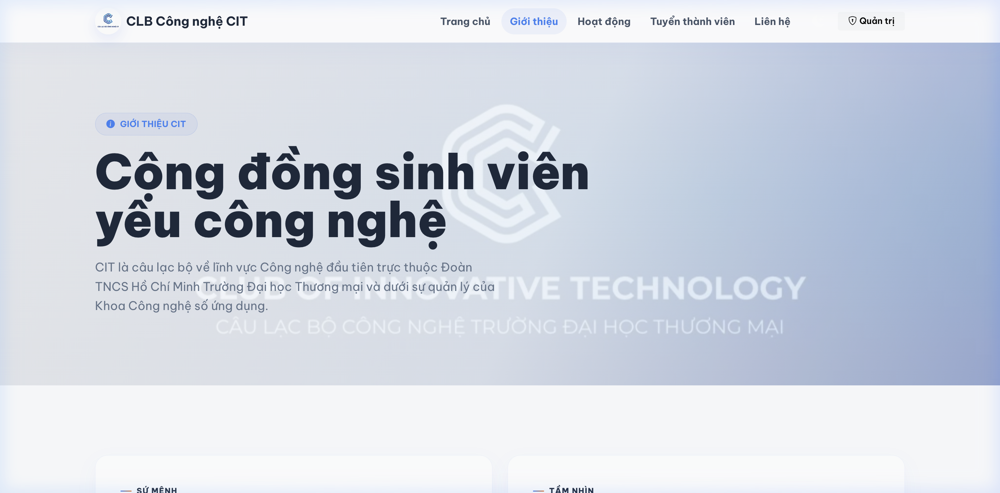
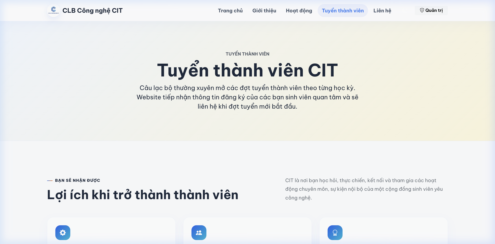
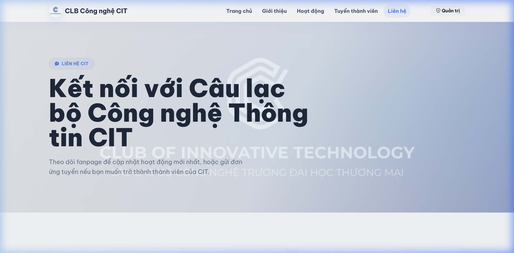
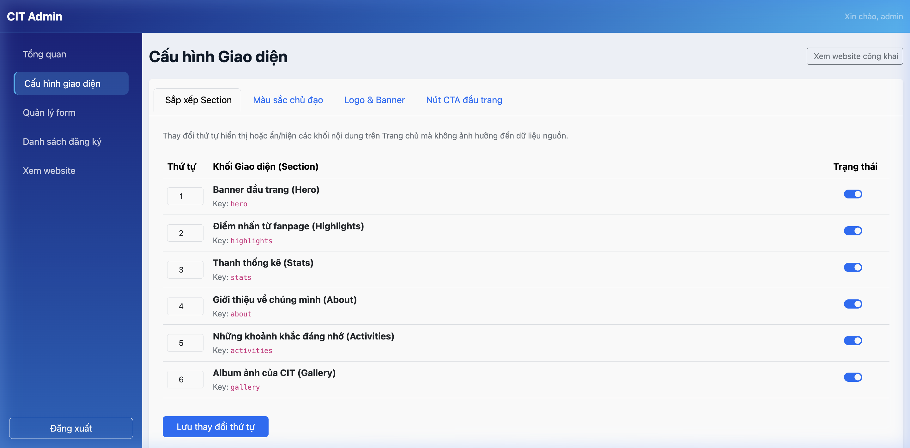

# Câu lạc bộ Công nghệ CIT - Website Tuyển thành viên

Website chính thức tuyển thành viên của Câu lạc bộ Công nghệ CIT (Trường Đại học Thương mại), được xây dựng bằng PHP thuần, PDO, MySQL và Bootstrap 5. 

Dự án này đã được tối ưu hóa đặc biệt để có thể hoạt động mượt mà và tải cực nhanh trên các hosting chia sẻ (Shared Hosting) có cấu hình cực thấp (ví dụ: 1 CPU, 512MB RAM, 2GB SSD).

---

## 🛠️ Yêu cầu hệ thống

*   **PHP:** Phiên bản `8.1` trở lên (Yêu cầu bật extension `pdo_mysql`, `mbstring`, `gd`, `xml`, `zip`).
*   **Database:** MySQL `5.7` trở lên hoặc MariaDB tương thích.
*   **Composer:** Phiên bản `2.x`.

---

## 🚀 Hướng dẫn cài đặt & Chạy cục bộ (Local)

Thực hiện các bước sau sau khi clone mã nguồn dự án về máy:

### 1. Cài đặt các thư viện phụ thuộc
Chạy lệnh sau tại thư mục gốc của dự án để thiết lập autoloader tối ưu hóa:
```bash
composer install --no-dev --optimize-autoloader
```

### 2. Thiết lập cấu hình môi trường
*   Sao chép tệp tin cấu hình mẫu thành tệp hoạt động thực tế:
    ```bash
    cp .env.example .env
    ```
*   Mở tệp `.env` vừa tạo và chỉnh sửa thông tin kết nối Cơ sở dữ liệu cho phù hợp với máy của bạn (`DB_HOST`, `DB_NAME`, `DB_USER`, `DB_PASS`). Đặt `APP_URL` thành URL công khai chính xác của website để ảnh trong email hiển thị được ở mọi ứng dụng đọc thư.
*   Để gửi kết quả tuyển thành viên, cấu hình thêm `MAIL_HOST`, `MAIL_PORT`, `MAIL_USERNAME`, `MAIL_PASSWORD`, `MAIL_ENCRYPTION` và `MAIL_FROM_ADDRESS`. Mật khẩu SMTP chỉ nằm trong `.env`, không được lưu trong database.

### 3. Cài đặt MySQL & Nhập (Import) Cơ sở dữ liệu

#### A. Cài đặt MySQL (nếu chưa có)
Nếu máy của bạn chưa cài đặt PHP & MySQL, phương thức đơn giản nhất là sử dụng các bộ phần mềm tích hợp sẵn:
*   **Dành cho Windows:** Khuyên dùng [Laragon](https://laragon.org/) hoặc [XAMPP](https://www.apachefriends.org/).
*   **Dành cho macOS:** Khuyên dùng [MAMP](https://www.mamp.info/) hoặc cài đặt qua Homebrew: `brew install mysql`.
*   *Tải lẻ MySQL:* Bạn cũng có thể tải trực tiếp từ [MySQL Community Server](https://dev.mysql.com/downloads/mysql/).

#### B. Cách nhập (Import) cơ sở dữ liệu mẫu
Sau khi đã cài đặt và khởi động dịch vụ MySQL, bạn thực hiện import file cơ sở dữ liệu [database.sql](file:///Users/tranthanh/Documents/Workspaces/WEB_CIT/database.sql) theo 1 trong 2 cách sau:

##### Cách 1: Sử dụng phpMyAdmin (Trực quan - khuyên dùng)
1.  Mở trình duyệt, truy cập vào đường dẫn quản lý cơ sở dữ liệu (thường là `http://localhost/phpmyadmin` khi sử dụng XAMPP/MAMP).
2.  Click chọn tab **Cơ sở dữ liệu (Databases)** ở trên cùng.
3.  Nhập tên cơ sở dữ liệu mới (ví dụ: `club_management`), chọn bảng mã `utf8mb4_unicode_ci` và nhấn **Tạo (Create)**.
4.  Chọn cơ sở dữ liệu `club_management` vừa tạo ở thanh bên trái.
5.  Chọn tab **Nhập (Import)** ở thanh menu trên cùng.
6.  Nhấn nút **Chọn tệp (Choose File)** và tìm đến tệp tin [database.sql](file:///Users/tranthanh/Documents/Workspaces/WEB_CIT/database.sql) trong thư mục dự án của bạn.
7.  Cuộn xuống dưới cùng và nhấn nút **Nhập (Import / Go)**.

##### Cách 2: Sử dụng dòng lệnh Terminal / Command Prompt (Nhanh)
1.  Mở Terminal (macOS/Linux) hoặc Command Prompt (Windows).
2.  Đăng nhập vào MySQL và tạo cơ sở dữ liệu:
    ```bash
    mysql -u root -p
    # Nhập mật khẩu MySQL của bạn (nếu có), sau đó chạy lệnh:
    CREATE DATABASE club_management CHARACTER SET utf8mb4 COLLATE utf8mb4_unicode_ci;
    EXIT;
    ```
3.  Thực hiện import file SQL trực tiếp bằng lệnh:
    ```bash
    mysql -u root -p club_management < /đường/dẫn/đến/dự/án/database.sql
    # Ví dụ trên Windows: mysql -u root -p club_management < C:\path\to\project\database.sql
    ```

Nếu nâng cấp từ phiên bản website đã có dữ liệu, chỉ chạy migration email thay vì import lại toàn bộ database:
```bash
mysql -u root -p club_management < database/migrations/20260713_recruitment_email.sql
```

### 4. Chạy Server phát triển cục bộ
Khởi động PHP built-in server tại thư mục gốc dự án:
```bash
php -d post_max_size=32M -d upload_max_filesize=5M -d max_file_uploads=10 -S localhost:8000
```
Mở trình duyệt và truy cập: `http://localhost:8000` để xem kết quả.

### 5. Quản trị hệ thống
*   Đường dẫn trang quản trị: `http://localhost:8000/admin/login.php`
*   Tài khoản đăng nhập mặc định:
    *   **Username:** `admin`
    *   **Password:** `admin123`
*   *Lưu ý bảo mật:* Vui lòng thay đổi mã băm mật khẩu trong database trước khi đưa trang web lên môi trường thật.

---

## 📸 Giao diện các màn hình

### 1. Trang chủ (Home Page)


### 2. Giới thiệu (About Page)


### 3. Tuyển thành viên (Recruitment Page)


### 4. Liên hệ (Contact Page)


### 5. Quản trị Giao diện (Admin Settings)


---

## ⚡ Các giải pháp tối ưu hiệu năng đã triển khai

Website được áp dụng các cơ chế tối ưu giúp giảm tải CPU, RAM và tối đa hóa dung lượng trống:

1.  **Trì hoãn kết nối Database (Lazy Connect):** Lớp proxy `LazyPDO` đảm bảo kết nối MySQL chỉ mở ra khi thực sự có câu lệnh truy vấn dữ liệu (không tự động kết nối ngay khi tải trang).
2.  **Bộ đệm trường thông tin (Fields Caching):** Cấu trúc trường trong trang tuyển thành viên được lưu ra file tĩnh PHP tại `cache/form-fields.php`. Người dùng tải trang không tạo bất kỳ query nào đến MySQL.
3.  **Static Page Caching:** Bộ đệm HTML tĩnh được áp dụng cho toàn bộ các trang công khai (Trang chủ, Giới thiệu, Hoạt động, Liên hệ, Tuyển thành viên) giúp thời gian tải trang nhanh như trang web tĩnh (TTFB < 15ms).
4.  **Tự động dọn dẹp Log:** Cơ chế tự động cắt ngắn tệp log lỗi khi vượt quá 5MB để tránh làm đầy bộ nhớ SSD 2GB.
5.  **Asset Minification:** Toàn bộ CSS và JS tùy chỉnh đều được biên dịch rút gọn (`app.min.css` và `editable.min.js`) để tăng tốc độ tải file.
6.  **Loại bỏ thư viện thừa:** Đã gỡ bỏ thư viện nặng `phpspreadsheet` do hệ thống hỗ trợ xuất file Excel dưới định dạng CSV thô siêu nhẹ bằng hàm mặc định của PHP.
7.  **Gửi email tuần tự:** Mỗi request chỉ xử lý một người nhận qua PHPMailer, giúp thao tác gửi hàng loạt không chiếm nhiều RAM và có thể tiếp tục nếu đóng trang quản trị.

---

## 📦 Biên dịch tài nguyên tĩnh (Minify Assets)

Nếu bạn thay đổi hoặc phát triển thêm mã nguồn trong các tệp CSS/JS gốc ([assets/css/app.css](file:///Users/tranthanh/Documents/Workspaces/WEB_CIT/assets/css/app.css) hoặc [assets/js/editable.js](file:///Users/tranthanh/Documents/Workspaces/WEB_CIT/assets/js/editable.js)), hãy chạy lệnh sau để tự động rút gọn và cập nhật vào các tệp `.min.*`:

```bash
php scripts/build.php
```
Tệp tin [scripts/build.php](file:///Users/tranthanh/Documents/Workspaces/WEB_CIT/scripts/build.php) sẽ tự động minify và cập nhật lại giao diện tĩnh mới nhất.
